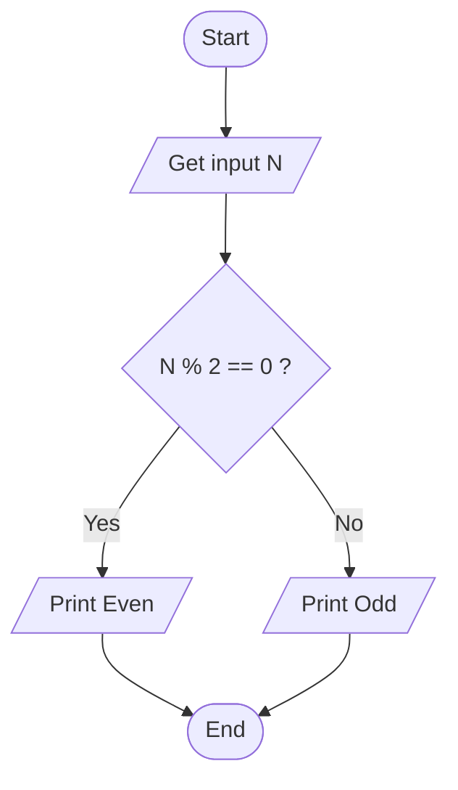

# Workshop: Algorithm and Flowchart

For each question in this workshop, you must complete **two** things:

1.  **Write the pseudocode**
2.  **Draw the flowchart** using either
    - **Option 1:** Draw.io (recommended) → export image → upload to
      your repository → link it in this file
    - **Option 2 (optional):** Write a Mermaid flowchart directly in
      Markdown
    - **Option 3 (optional):** Any other valid method

👉 **IMPORTANT:** At the **bottom of each question**, add the
following sections:

### ✔ Pseudocode

### ✔ Flowchart

---

## 1. Check Even or Odd Number

Design an algorithm and flowchart that take a number as input and
determine whether it is even or odd.

### ✔ Pseudocode

```text
START
    INPUT number
    IF number % 2 == 0 THEN
        PRINT Even
    ELSE
        PRINT Odd
    ENDIF
END
```

### ✔ Flowchart



---

## 2. Calculate Total and Average Marks

Write the algorithm and draw the flowchart for a program that inputs
marks for 3 subjects, calculates the total and average, and displays
both.

### ✔ Pseudocode

Start
Input "Enter grades A, B and C: " → A, B, C

total ← A + B + C
average ← total / 3

Display "Total = " , total
Display "Average = " , average

End


### ✔ Flowchart

https://github.com/majabloom133/algorithms-pseudocode-flowcharts/blob/989eccdf6737ff06335f8ccd90ee8b5972381a6e/algorithms-pseudocode-flowcharts/Exercise%202.drawio.png

---

## 3. Display Multiplication Table

Create an algorithm and flowchart that input a number and display its
multiplication table from 1 to 10 using a loop.

### ✔ Pseudocode

Start
Input "Enter a number: " → n

i ← 1
While i < 10

    result ← n * i

    Display n , " x " , i , " = " , result

i ← i + 1
End While

End

### ✔ Flowchart

https://github.com/majabloom133/algorithms-pseudocode-flowcharts/blob/989eccdf6737ff06335f8ccd90ee8b5972381a6e/algorithms-pseudocode-flowcharts/Exercise%203.drawio.png

---

## 4. Positive, Negative, or Zero Check

Write the algorithm and flowchart to input a number and display whether
it is positive, negative, or zero.

### ✔ Pseudocode

Start
Input "Enter a number: " → n

If n > 0 Then
   Display "The number is positive."
Else
   If n < 0 Then
      Display "The number is negative."
Else
   Display "The number is zero,"
      End If
  End If

 End

### ✔ Flowchart

https://github.com/majabloom133/algorithms-pseudocode-flowcharts/blob/989eccdf6737ff06335f8ccd90ee8b5972381a6e/algorithms-pseudocode-flowcharts/Exercise%204.drawio.png

---

## 5. Simple Interest Calculator

Create an algorithm and flowchart for a program that calculates simple
interest using the formula:

**SI = (P × R × T) / 100**

- **P = Principal** → original amount of money
- **R = Rate of Interest** → percentage per year
- **T = Time** → number of years

### ✔ Pseudocode
Start
   Display "Enter Principal (P):"
   Read P

   Display "Enter Rate of interest (R) % per year:"
   Read R

   Display "Enter Time (T) in years:"
   Read T

  Set SI ← (P * R * T) / 100
   Display "Simple Interest = ", SI

End

### ✔ Flowchart

https://github.com/majabloom133/algorithms-pseudocode-flowcharts/blob/989eccdf6737ff06335f8ccd90ee8b5972381a6e/algorithms-pseudocode-flowcharts/Exercise%205.drawio%20(1).png

---

## 6. Average Temperature Calculation

Write the algorithm and draw the flowchart for a program that takes the
temperature of 7 days, finds the average temperature, and displays it.


### ✔ Pseudocode
Start

i ← 1
sum ← 0

While i <= 7
  Display "Enter temperature for day " , i , ": " 
   Read temp 
   sum ← sum + temp
   i ← i + 1
End while

average ← sum / jag fattar inte 7
Display "Average temperature = " , average

End

### ✔ Flowchart

https://github.com/majabloom133/algorithms-pseudocode-flowcharts/blob/989eccdf6737ff06335f8ccd90ee8b5972381a6e/algorithms-pseudocode-flowcharts/Exercise%206.drawio.png

---

## 7. Calculate Area of a Rectangle

Create an algorithm and flowchart to input length and width, calculate
the area (**Area = Length × Width**), and display the result.

### ✔ Pseudocode

Start
Display "Enter the Length of the rectangle: "
Read Length

Display "Enter the Width of the rectangle: "
Read Width

If (Length < 0) or (Width < 0) Then
   Display "Error: Length and Width must be non-negative."
   Stop
End If

Area ← Length * Width

Display "Area of the rectangle = ", area

End


### ✔ Flowchart

https://github.com/majabloom133/algorithms-pseudocode-flowcharts/blob/989eccdf6737ff06335f8ccd90ee8b5972381a6e/algorithms-pseudocode-flowcharts/Exercise%207.drawio.png

---

## 8. Determine Pass or Fail

Write the algorithm and draw the flowchart for a program that takes a
student's average marks and displays **"Pass"** if average ≥ 50,
otherwise **"Fail"**.

### ✔ Pseudocode
Start
Display "Enter the student's average mark:"
   Read average

If average ≥ 50 Then
   Display "Pass"
  Else
   Display "Fail"
End If

End


### ✔ Flowchart

https://github.com/majabloom133/algorithms-pseudocode-flowcharts/blob/989eccdf6737ff06335f8ccd90ee8b5972381a6e/algorithms-pseudocode-flowcharts/Exercise%208.drawio.png

---

## 9. Calculate Factorial of a Number

Write the algorithm and draw the flowchart that input a number and
calculate its factorial using a loop.

---

### ✔ Pseudocode
Start

Display "Enter a number:"
Read n

Set Result ←1
Set i ← 1

While i ≤ n then
   Set result ← result * i 
   Set i ← i + 1
   End while

Display "Factorial = " , result
End

### ✔ Flowchart

https://github.com/majabloom133/algorithms-pseudocode-flowcharts/blob/989eccdf6737ff06335f8ccd90ee8b5972381a6e/algorithms-pseudocode-flowcharts/Exercise%209.drawio.png

---

## 10. Calculate Discount on Purchase

Write the algorithm and draw the flowchart for a program that inputs the
purchase amount and gives a **10% discount** if the amount is greater
than 1000.

### ✔ Pseudocode
Start

   Display "Enter purchase amount:"
   Read amount

If amount > 1000 then
   discount <- amount * 0.10
   total <- amount - discount

Else
   total <- amount
End if

Display "Amount to pay: ", total
End

### ✔ Flowchart

https://github.com/majabloom133/algorithms-pseudocode-flowcharts/blob/989eccdf6737ff06335f8ccd90ee8b5972381a6e/algorithms-pseudocode-flowcharts/Exercise%2010.drawio%20(1).png

---
